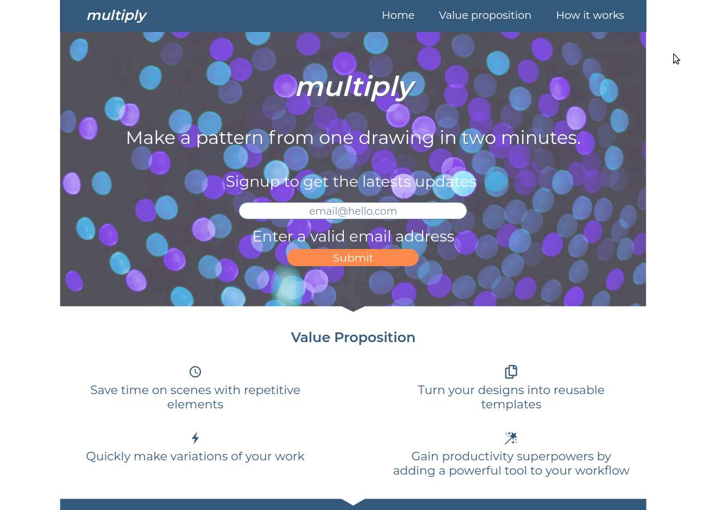

## Multiply - Client

WIP: This is the client for Multiply's landing page, a static page with a signup form that collects emails for a mailing list.

## Description

The goal of this project is to create a landing page for Multiply, a vector graphics project. 

Multiply lets designers quickly create variations of object designs, making them more efficient in creating repetitive patterns, a process that is now done by hand.

Multiply will be released as a plugin for Adobe Illustrator and Bohemian Sketch, and will integrate natively with the target software.

## Demo - WIP

## Tech stack

* JavaScript
* React
* CSS

## Features

* Form 
* Submit button:
   * adds the email to a database 
   * shows a confirmation message to the user
   * sends a registration confirmation mail to the subscriber 

## Setup

* The backend (server) of this project must be running for the app to function correctly.
* Install the dependencies using `yarn install`
* Start the server using `yarn start`

## Motivation

I want to practice and improve:
* Building a responsive landing page.
* Styling a page with plain CSS.
* Implementing requirements received from the customer.

I want to learn:
* Mobile first versus Responsive pages.
* How to design and choose a color scheme for a landing page. 

## License

MIT Licence - Copyright &copy; 2019 - Alina Rusu.

